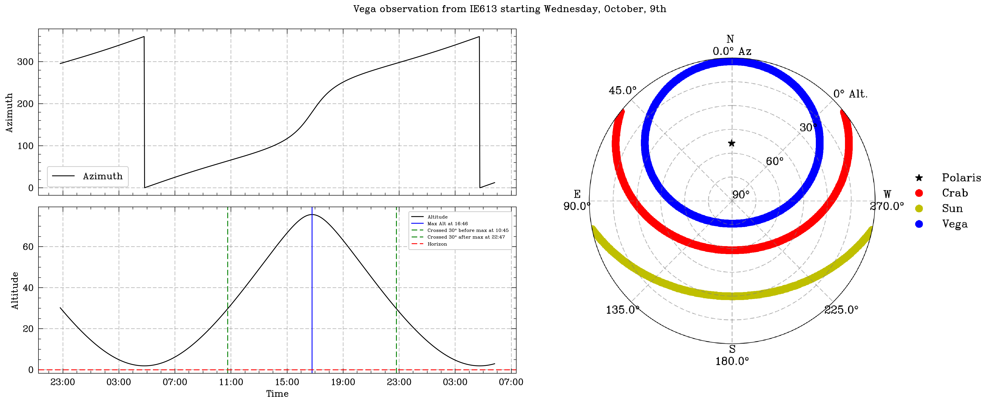

# I-LOFAR Observation Scheduling Scripts

### Altitude-Azimuth Plotting Script

This script generates elevation and sensitivity plots for a given astronomical target at a specific observation window for the LOFAR IE613 station. It retrieves or calculates the coordinates of the target, benchmarks known targets (like Polaris, the Crab Pulsar, and the Sun), and plots their positions during the observation period.

### Purpose

- Plot elevation and sensitivity data for a given target at the LOFAR IE613 station.
- Generate sky plots for known benchmarks and the custom target.
- Save and display the plots for visualization.

### Requirements

The following Python libraries are required to run the script:

- `matplotlib`
- `astropy`
- `numpy`
- `astroplan`
- `astroquery`
- `scienceplots`

### Script Usage

The script can be executed via the command line with arguments specifying the target name, observation date, and optionally, right ascension (RA) and declination (Dec).

### Command-Line Arguments

- `--name`: **Required**. Name of the target to be observed (e.g., "Sun").
- `--date`: **Optional**. Observation start date and time in the format `YYYY-MM-DD HH:MM:SS`. If not provided, it defaults to the current time.
- `ra`: **Optional**. Right ascension of the target in radians or degrees.
- `dec`: **Optional**. Declination of the target in radians or degrees.

Note that if no RA and Dec are provided, the script will attempt to retrieve the coordinates of the target from the `simbad` database, ensure you use the correct target identifier in this case. 

### Example Usage

```bash
python altaz-single-target.py --name Sun --date "2024-03-05 12:00:00"
```

